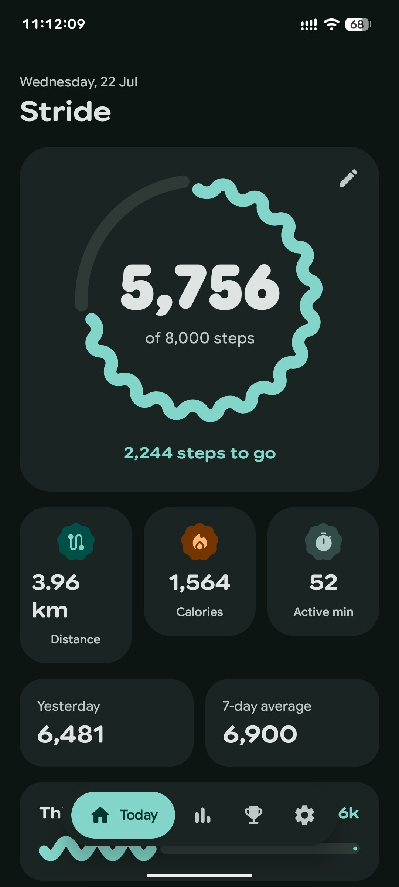
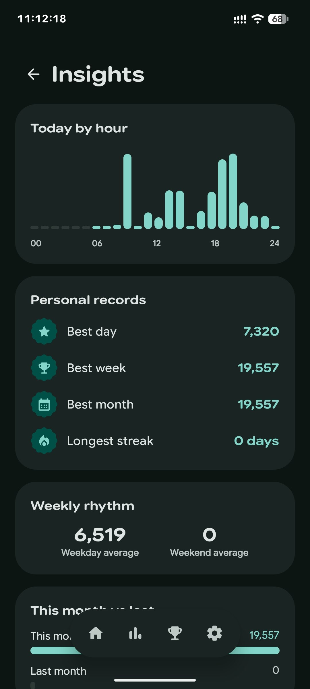
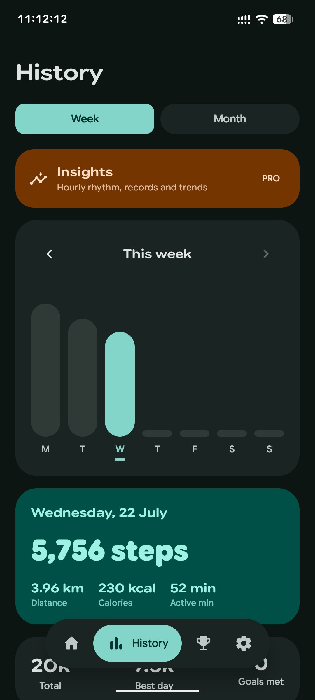
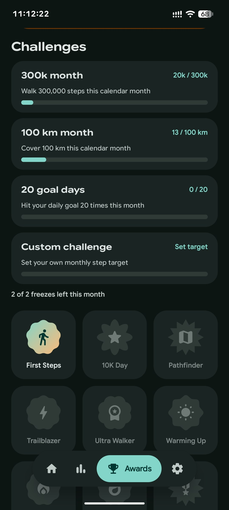
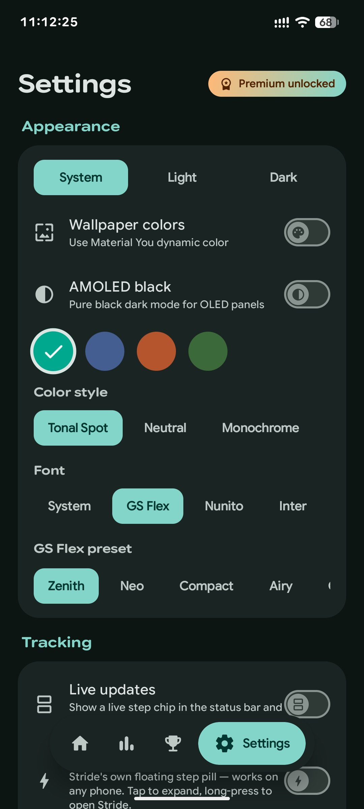

<a id="top"></a>
<div align="center">


# STRIDE


[](https://github.com/NikhilKain/stride/releases/latest)
[](#)
[](LICENSE)
[](https://kotlinlang.org)

<br/>

[](#features)
[](#editions)
[](#screenshots)
[](#build-it-yourself)
[](#under-the-hood)
[](#support)

</div>

<p align="center">
  
  
  
  
  
</p>

<p align="center">
  <sub><i>Some shots are from Stride Pro — see <a href="#editions">Editions</a>.</i></sub>
</p>

---

## Why another step counter?

Most of them want a login, a subscription, and permission to sell your movement
data to whoever asks. Stride wants none of that. It counts your steps, draws them
beautifully, and otherwise leaves you alone.

It reads from **Health Connect** when you allow it and falls back to the phone's
hardware step counter when you don't — so it works on day one whether or not you
use any other fitness app. The two sources are merged by taking whichever saw
more steps, never by adding them, so nothing is ever double-counted.

<a id="features"></a>
## ✨ What's inside

<table>
<tr>
<td width="50%" valign="top">

**🚶 Counting that actually works**
A foreground service keeps counting with the screen off and survives a reboot. The hardware counter does the work in silicon, so the battery cost is close to nothing.

**📊 A dashboard worth opening**
A wavy ring that fills as you walk, an odometer that rolls digit by digit, and distance, calories and active minutes underneath. Distance uses a stride length calibrated from your height (with a manual override), not a guess.

**📅 History at a glance**
A weekly bar chart and a monthly calendar heatmap, with any day tappable for the detail.

**🏅 Streaks and 14 achievements**
Each a morphing Material shape rather than another gold star — from *First Steps* to *Millionaire* at 1,000,000 lifetime steps.

**🔔 Live Updates on Android 16**
A promoted ongoing notification puts your progress in the status bar. Support is patchy across manufacturers, so Stride tells you honestly whether your ROM renders it — and falls back to its own island-style overlay when it doesn't.

</td>
<td width="50%" valign="top">

**🖼️ Share cards, three ways**
Renders your day as a Story (1080×1920), Post (1080×1350), or Square (1080×1080) image, gradient and all, ready for wherever you post things.

**🎨 Theming, seriously**
Light, dark, system, or pure-black AMOLED. Material You wallpaper colours. Four hand-tuned palettes, five colour styles, and seven bundled variable fonts you can actually tell apart.

**💾 Backups that are just a file**
Everything exports to a single JSON you can read, keep, and import on another phone. No cloud in the middle.

**🔄 Built-in updater**
Checks GitHub Releases on your own schedule — daily, weekly, monthly, or manual — with an in-app changelog dialog. No Play Store dependency.

**🌐 8 languages**
English, Arabic, German, Spanish, French, Hindi, Portuguese, and Russian, with an in-app language picker.

</td>
</tr>
</table>

<a id="editions"></a>
## 💎 Editions

Stride is developed **open-core** — one codebase, one APK, not a separate download. Everything in this repository is free forever: tracking, history, all 14 achievements, 2 of the 4 palettes (*Tide* and *Zen*), all 5 colour styles, all 7 fonts, backups, and the built-in updater. Nothing here is time-limited, nagged, or switched off to upsell you.

A one-time Gumroad licence key unlocks **Stride Pro** in the same app:

<table>
<tr><td>

- 🗺️ **GPS walk tracker** with OpenStreetMap-based maps
- 📈 **Deeper insights**
- 📱 **Home-screen widget**
- 🎨 Two extra palettes — *Ember* and *Forest*

<div align="center">

[](https://narzo7.gumroad.com/l/quqta)

</div>

</td></tr>
</table>

<a id="screenshots"></a>
## 📱 Screenshots

<p align="center">
  
  
  
  
  
</p>

## Install

Grab the APK from [Releases](https://github.com/NikhilKain/stride/releases/latest).
Android 8.0 or newer.

On first launch Stride asks for **Physical activity** — it genuinely cannot count
steps without it. Notifications are optional, and only used for the ongoing
counter and goal nudges.

<a id="build-it-yourself"></a>
## 🔧 Build it yourself

You need **JDK 17** and the Android SDK with **API 36**.

```bash
git clone https://github.com/NikhilKain/stride
cd stride
./gradlew assembleDebug
```

The wrapper fetches the right Gradle, so that's the whole setup. Your APK lands in
`app/build/outputs/apk/debug/`.

If Gradle can't find your SDK, point it there:

```properties
# local.properties
sdk.dir=/path/to/Android/Sdk
```

<details>
<summary><b>Building with the Pro unlock enabled</b></summary>
<br/>

The app builds and runs fully without it — the Gumroad product ID in `local.properties` is only needed to reproduce production licence verification:

| Key | Purpose | If omitted |
|---|---|---|
| `gumroad.product.id` | Stride Pro licence verification | Verification disabled — Pro stays locked |

Everything else — tracking, history, achievements, the free palettes and fonts, backups, and the updater — works fully without any secrets configured.

</details>

<a id="under-the-hood"></a>
## 🛠 Under the hood

<div align="center">


</div>

| | |
|---|---|
| Language | Kotlin |
| UI | Jetpack Compose, Material 3 Expressive (`1.5.0-alpha17`) |
| Data | Health Connect, Room, DataStore |
| Background | Foreground service, WorkManager |
| Maps (Pro) | osmdroid (OpenStreetMap) |
| Widget | Jetpack Glance |
| Min / target SDK | 26 / 36 |

Material 3 Expressive is pinned to an alpha deliberately — the wavy progress
indicators, shape morphing and `MotionScheme` this UI leans on aren't in the
stable release yet.

## Contributing

Issues and pull requests are welcome. Because Stride Pro shares this codebase,
contributions need a short copyright assignment before they can be merged — open
an issue first and we'll sort it out there.

## Credits

The bundled variable typefaces — Nunito, Inter, Outfit, Lexend, Manrope and
Space Grotesk — are used under the
[SIL Open Font License](https://scripts.sil.org/OFL). Google Sans Flex is
bundled as an additional display option.

<a id="support"></a>
## 💖 Support

If Stride is useful to you:
- ⭐ Star this repo
- 💎 Grab [Stride Pro](https://narzo7.gumroad.com/l/quqta) — it's the main thing that funds ongoing development
- 🐛 Report bugs in [Issues](https://github.com/NikhilKain/stride/issues)

### ☕ Buy Me a Coffee

Hey! 👋 I'm Nikhil, an indie Android developer building this project in my free time — a step counter that doesn't want your login, your subscription, or your data.

Every contribution goes directly toward new features, bug fixes, performance improvements, and long-term development.

<div align="center">

[](https://narzo7.gumroad.com/l/nhlevz)

*Thank you for supporting independent open-source development ❤️*

</div>

## Licence

[](LICENSE)

Stride is free software: redistribute and modify it under the terms of the GPL.
It comes with no warranty.

<br/>

<div align="center">


Built with ❤️, one step at a time.

[⬆ Back to top](#top)

</div>
